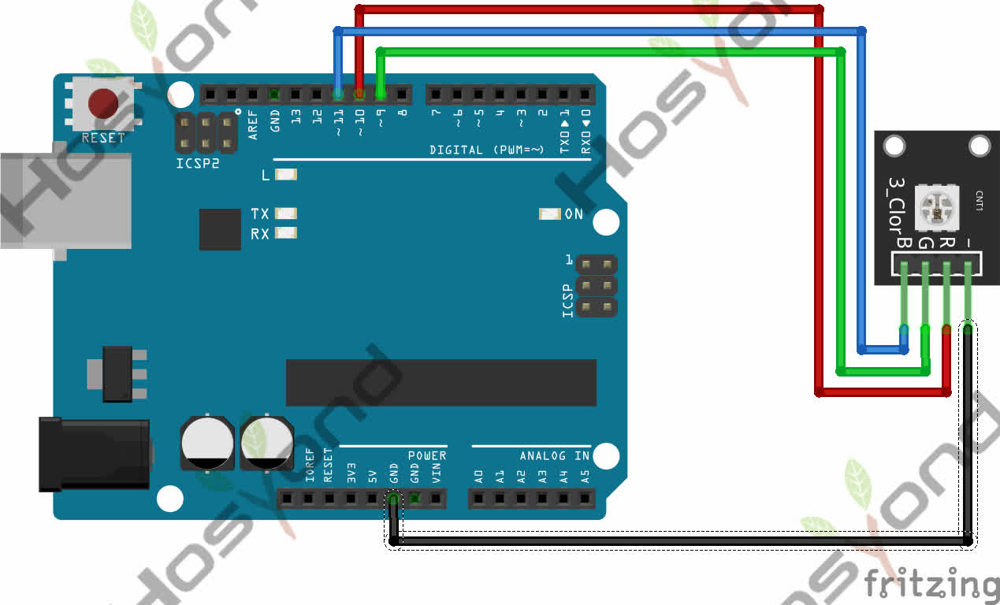

# 2 SMD LED

## Description

This is a full-color LED module, which contains 3 basic colors－red, green and blue. They can be seen as separate LED lights. After programming, you can turn them on and off by sequence or can also use PWM analog output to mix three colors to generate different colors.

## Specification

- Color: Red, Green, and Blue
- Brightness: High
- Voltage: 5V
- Input: Digital Level
- Size: 30*20mm
- Weight: 3g

## Connect



## Code

```rust
#[main]
fn main() -> ! {
    // generator version: 1.3.0
    // generator parameters: --chip esp32 -o unstable-hal -o esp32-wroom-32 -o log

    esp_println::logger::init_logger_from_env();

    let config = esp_hal::Config::default().with_cpu_clock(CpuClock::max());
    let peripherals = esp_hal::init(config);
    let delay = Delay::new();

    let mut ledc = Ledc::new(peripherals.LEDC);
    ledc.set_global_slow_clock(LSGlobalClkSource::APBClk);

    let mut lstimer0 = ledc.timer::<LowSpeed>(timer::Number::Timer0);
    lstimer0
        .configure(timer::config::Config {
            duty: timer::config::Duty::Duty10Bit,
            clock_source: timer::LSClockSource::APBClk,
            frequency: Rate::from_khz(5),
        })
        .unwrap();

    let mut ch_r = ledc.channel(channel::Number::Channel0, peripherals.GPIO25);
    let mut ch_g = ledc.channel(channel::Number::Channel1, peripherals.GPIO26);
    let mut ch_b = ledc.channel(channel::Number::Channel2, peripherals.GPIO27);

    for ch in [&mut ch_r, &mut ch_g, &mut ch_b] {
        ch.configure(channel::config::Config {
            timer: &lstimer0,
            duty_pct: 0,
            drive_mode: esp_hal::gpio::DriveMode::PushPull,
        })
        .unwrap();
    }

    // Fase 0: rosso pieno, verde e blu spenti
    ch_r.set_duty(100).unwrap();
    ch_g.set_duty(0).unwrap();
    ch_b.set_duty(0).unwrap();

    loop {
        fade(&mut ch_r, &mut ch_g, &delay);
        fade(&mut ch_g, &mut ch_b, &delay);
        fade(&mut ch_b, &mut ch_r, &delay);
    }

}

fn fade(
    from: &mut channel::Channel<'_, LowSpeed>,
    to: &mut channel::Channel<'_, LowSpeed>,
    delay: &Delay,
) {
    for pct in 0..=100u8 {
        from.set_duty(100 - pct).unwrap();
        to.set_duty(pct).unwrap();
        delay.delay_millis(15);
    }
}
```

## References

- [Hosyond](https://45-in-1-sensor-kit.readthedocs.io/en/latest/2.smd_rgb.html)
