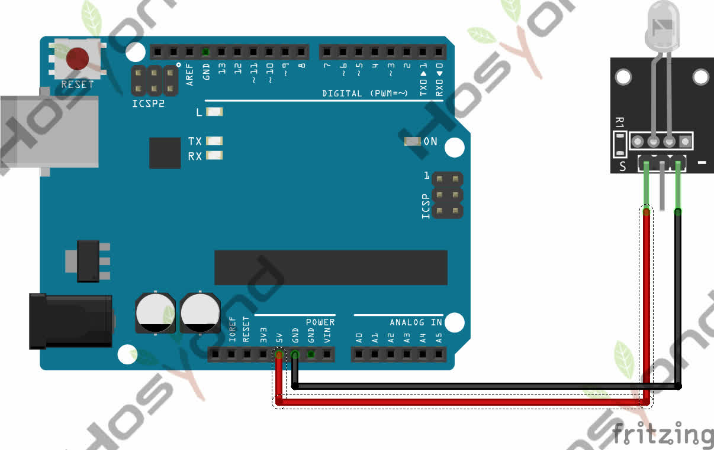

# 7 Color Flash

## Description

This is a seven-color flashing module that can emit seven colors, including red, green, and blue.

## Specification

- Color: 7
- Brightness: High
- Voltage: 5V
- Input: Digital Level
- Size: 30*20mm
- Weight: 3g

## Connect

## References

- [Hoysond](https://45-in-1-sensor-kit.readthedocs.io/en/latest/3.7_color_flash.html)
