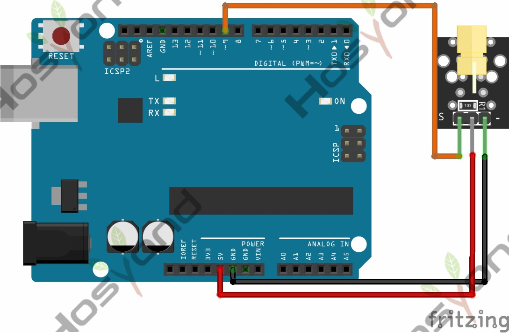

# 04 Laser Module

## Description

The KY-008 is a laser transmitter module that creates a dot-shaped laser beam
that can be used as a laser pointer or to create mini laser shows.

## Specification

- Wavelength: 650 nm (Red)
- Laser Power: 5 mW
- Operating Voltage: 3-5 volts
- Operating Current: ~ 30 mA

## Connect



## Code

```rust
#[main]
fn main() -> ! {
    // generator version: 1.3.0
    // generator parameters: --chip esp32 -o esp32-wroom-32 -o unstable-hal

    let config = esp_hal::Config::default().with_cpu_clock(CpuClock::max());
    let peripherals = esp_hal::init(config);
    let delay = Delay::new();

    let mut laser = Output::new(peripherals.GPIO4, Level::Low, OutputConfig::default());

    loop {
        laser.set_high();
        delay.delay_millis(1000);

        laser.set_low();
        delay.delay_millis(1000);
    }

    // for inspiration have a look at the examples at https://github.com/esp-rs/esp-hal/tree/esp-hal-v1.1.0/examples
}
```

## References

- [Hosyond 45 in 1 Sensor Kit Documentation](https://45-in-1-sensor-kit.readthedocs.io/en/latest/4.laser_module.html)
