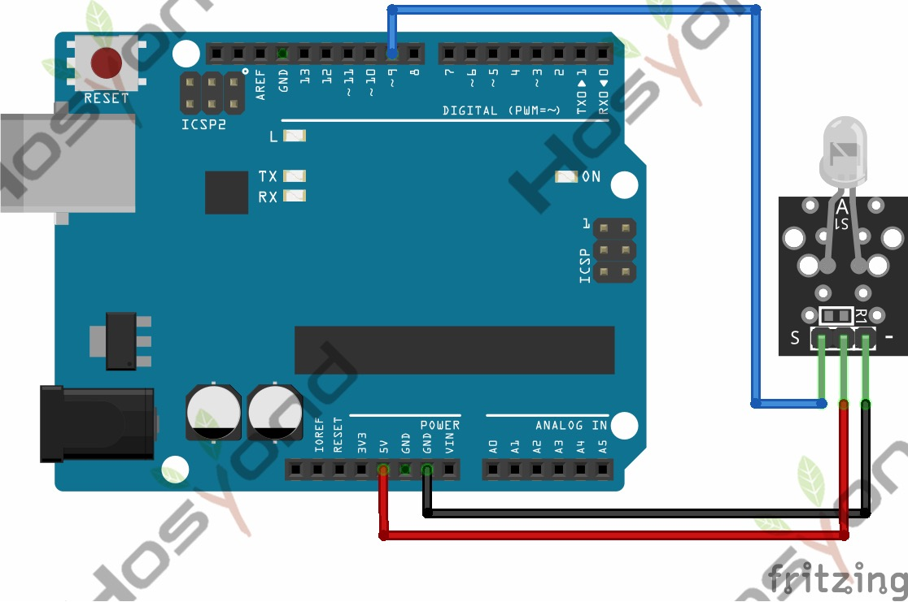

# 05 Ir Transmitters

## Description

IR transmitter module is designed for IR communication, which is widely used for
operating the television device from a short line-of-sight distance. Since
infrared (IR) remote control uses light, it requires line of sight to operate
the destination device. The signal can, however, be reflected by mirrors, just
like any other light sources. Infrared receivers also tend to have a more or
less limited operating angle, which mainly depends on the optical characteristics
of the phototransistor. However, it’s easy to increase the operating angle
using a matte transparent object in front of the receiver.

## Specification

- Power Supply: 3-5V
- Infrared center frequency: 850nm-940nm
- Infrared emission angle: about 20 degrees
- Infrared emission distance: about 1.3m (5V 38Khz)
- Interface socket: JST PH2.0
- Mounting hole: inner diameter is 3.2mm, spacing is 15mm

## Connect



## Code

```rust
#[main]
fn main() -> ! {
    // generator version: 1.3.0
    // generator parameters: --chip esp32 -o esp32-wroom-32 -o unstable-hal

    let config = esp_hal::Config::default().with_cpu_clock(CpuClock::max());
    let peripherals = esp_hal::init(config);
    let delay = Delay::new();

    let mut transmitter = Output::new(
        peripherals.GPIO4,
        esp_hal::gpio::Level::Low,
        OutputConfig::default(),
    );

    loop {
        transmitter.set_high();
        delay.delay_millis(1000);

        transmitter.set_low();
        delay.delay_millis(1000);
    }

    // for inspiration have a look at the examples at https://github.com/esp-rs/esp-hal/tree/esp-hal-v1.1.0/examples
}
```

## References

- [Hosyond 45 in 1 Sensor Kit Documentation](https://45-in-1-sensor-kit.readthedocs.io/en/latest/5.ir_transmitters.html)
