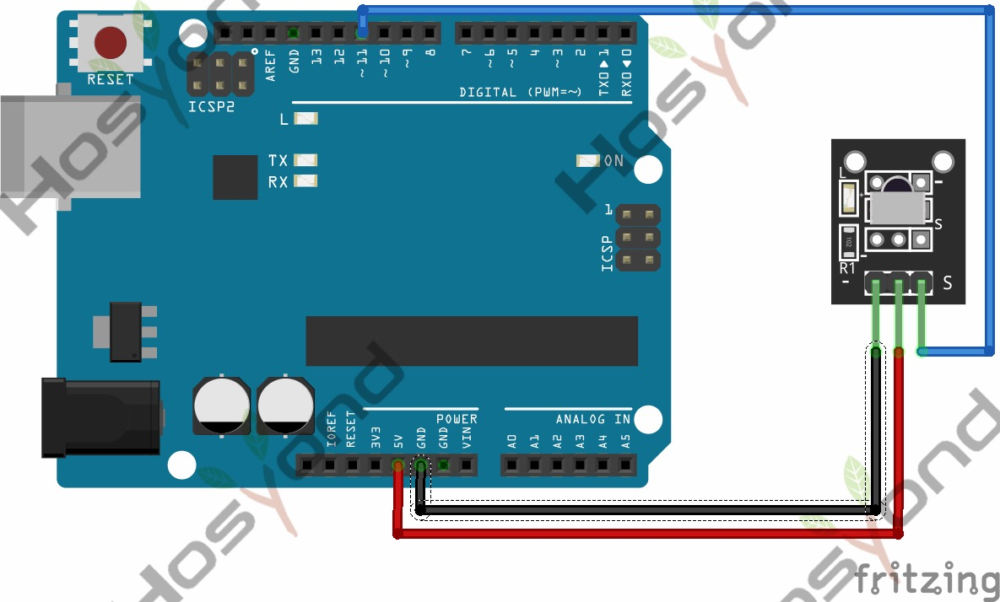

# 06 Ir Receiver

## Description

IR is widely used in remote control. With this IR receiver, Arduino project is
able to receive command from any IR remoter controllers if you have the right
decoder. Well, it will be also easy to make your own IR controller using IR
transmitter.

## Specification

- Power Supply: 5V
- Interface: Digital
- Modulation Frequency: 38Khz
- Module Interface Socket: JST PH2.0
- Size: 30*20mm
- Weight: 4g

## Connect



## Code

```rust

```

## References

- [Hosyond 45 in 1 Sensor Kit Documentation](https://45-in-1-sensor-kit.readthedocs.io/en/latest/6.ir_receiver.html)
