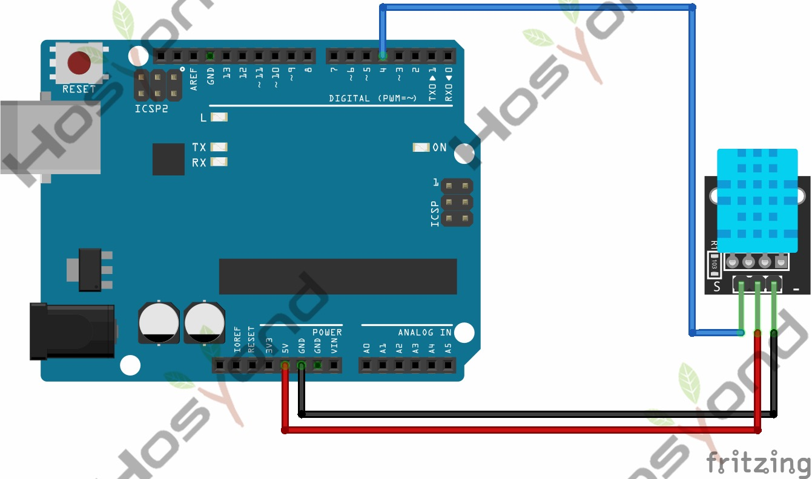

# 07 Dht11 Module

## Description

This DHT11 sensor features calibrated digital signal output with the temperature
and humidity sensor complex. Its technology ensures high reliability and excellent
long-term stability. A high-performance 8-bit microcontroller is connected on the
sensor. This sensor includes a resistive element and a sense of wet NTC temperature
measuring devices.It has advantages of excellent quality, fast response, anti-interference
ability and high cost performance.

Each DHT11 sensor features extremely accurate calibration data of humidity
calibration chamber. The calibration coefficients stored in the OTP program memory,
internal sensors detect signals in the process, and we should call these calibration
coefficients.The single-wire serial interface system is integrated to make it quick
and easy.Qualities of small size, low power, and 20-meter signal transmission
distance make it a wide applied application or even the most demanding one.

## Specification

- Supply Voltage: +5 V
- Temperature range: 0-50 °C error of ± 2 °C
- Humidity: 20-90% RH ± 5% RH error
- Interface: Digital

## Connect



## Code

Run `cargo add embedded-dht-rs` to add the library for the sensor.

```rust

#[main]
fn main() -> ! {
    let peripherals = esp_hal::init(esp_hal::Config::default());
    let delay = Delay::new();

    let mut dht11 = DHT11::new(peripherals.GPIO15, delay);

    loop {
        match dht11.read() {
            Ok(m) => {
                // qui puoi usare esp_println::println! per stampare su seriale
                let temp = m.temperature;
                let hum = m.humidity;
                esp_println::println!("Temp: {temp}, Hum: {hum}");
            }
            Err(_e) => {
                esp_println::println!("Cannot read");
            }
        }
        delay.delay_millis(2000); // il DHT11 non va letto più spesso di 1-2 volte al secondo
    }
}
```

## References

- [Hosyond 45 in 1 Sensor Kit Documentation](https://45-in-1-sensor-kit.readthedocs.io/en/latest/7.dht11_module.html)
