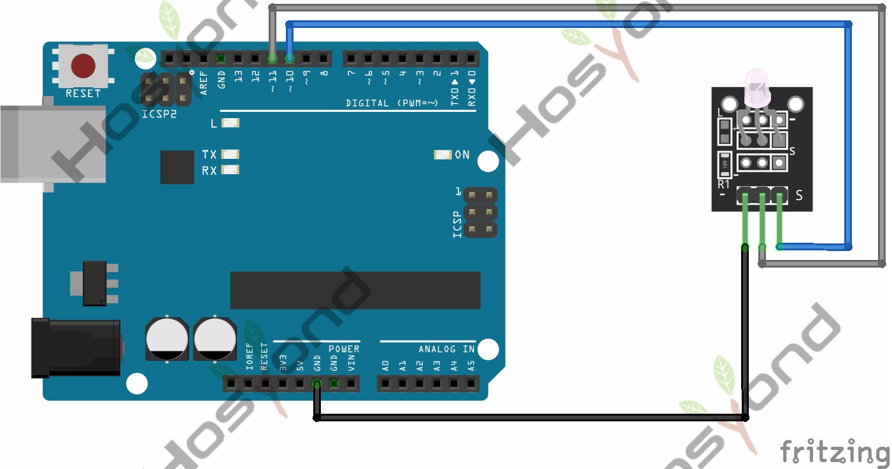

# 09 Mini Double Color Led

## Description

The KY-011 Two Color LED module emits red and green light. You can adjust the
intensity of each color using PWM.
Compatible with popular electronics platforms like Arduino, Raspberry Pi, ESP32
and more. This module is similar to the KY-029.

## Specification

- Operating Voltage     2.0v ~ 2.5v
- Working Current       10mA
- Diameter      3mm
- Package Type  Diffusion
- Color Red + Green
- Beam Angle    150
- Wavelength    571nm + 644nm
- Luminosity Intensity (MCD)    20-40; 40-80

## Connect



## Code

```rust
#[main]
fn main() -> ! {
    let peripherals = esp_hal::init(esp_hal::Config::default());
    let delay = Delay::new();

    let mut ledc = Ledc::new(peripherals.LEDC);
    ledc.set_global_slow_clock(LSGlobalClkSource::APBClk);

    let mut lstimer0 = ledc.timer::<LowSpeed>(timer::Number::Timer0);
    lstimer0
        .configure(timer::config::Config {
            duty: timer::config::Duty::Duty10Bit, // risoluzione: 1024 livelli
            clock_source: timer::LSClockSource::APBClk,
            frequency: Rate::from_khz(5),
        })
        .unwrap();

    let mut ch_r = ledc.channel(channel::Number::Channel0, peripherals.GPIO25);
    let mut ch_g = ledc.channel(channel::Number::Channel1, peripherals.GPIO26);

    for channel in [&mut ch_r, &mut ch_g] {
        channel
            .configure(channel::config::Config {
                timer: &lstimer0,
                duty_pct: 0, // 0-100
                drive_mode: esp_hal::gpio::DriveMode::PushPull,
            })
            .unwrap();
    }

    ch_r.set_duty(100).unwrap();
    ch_g.set_duty(0).unwrap();

    loop {
        fade(&mut ch_r, &mut ch_g, &delay);
        fade(&mut ch_g, &mut ch_r, &delay);
    }
}

fn fade(
    from: &mut channel::Channel<'_, LowSpeed>,
    to: &mut channel::Channel<'_, LowSpeed>,
    delay: &Delay,
) {
    for pct in 0..=100u8 {
        from.set_duty(100 - pct).unwrap();
        to.set_duty(pct).unwrap();
        delay.delay_millis(15);
    }
}
```

## References

- [Hosyond 45 in 1 Sensor Kit Documentation](https://45-in-1-sensor-kit.readthedocs.io/en/latest/9.mini_double_color_led.html)
