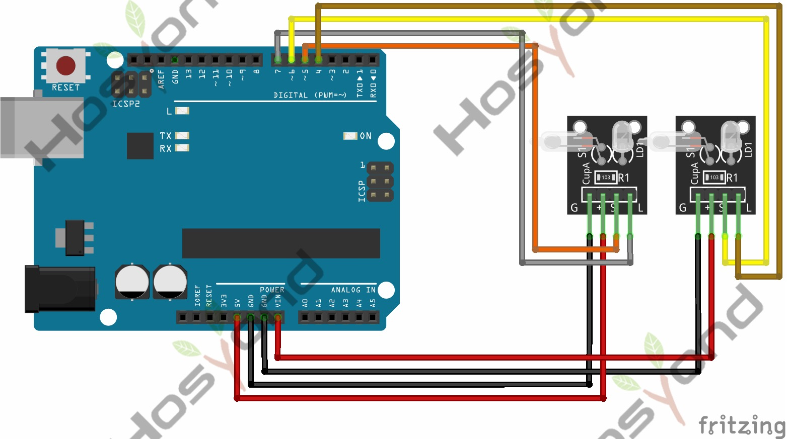

# 10 Light Cup

## Description

Magic light cup module is able to interact with ARDUINO. The principle is based
on PWM dimming.The mercury switch on the module can provide a digital signal and
trigger PWM regulation. The brightness of two modules will be changed together
through the program design, finally you can see the changing effect that two set
of cups are pouring the light.

## Specification

- Supply Voltage: 3.3V to 5V
- Interface: Digital

## Connect



## Code

```rust
#[main]
fn main() -> ! {
    let config = esp_hal::Config::default().with_cpu_clock(CpuClock::max());
    let peripherals = esp_hal::init(config);

    // Tilt switch (input)
    let sensor_a = Input::new(
        peripherals.GPIO18,
        InputConfig::default().with_pull(Pull::Down),
    );
    let sensor_b = Input::new(
        peripherals.GPIO26,
        InputConfig::default().with_pull(Pull::Down),
    );

    // LED pins come output PWM
    let led_a_pin = Output::new(peripherals.GPIO19, Level::Low, OutputConfig::default());
    let led_b_pin = Output::new(peripherals.GPIO25, Level::Low, OutputConfig::default());

    let mut ledc = Ledc::new(peripherals.LEDC);
    ledc.set_global_slow_clock(LSGlobalClkSource::APBClk);

    let mut timer = ledc.timer::<LowSpeed>(timer::Number::Timer0);
    timer
        .configure(timer::config::Config {
            duty: timer::config::Duty::Duty10Bit,
            clock_source: timer::LSClockSource::APBClk,
            frequency: Rate::from_khz(5),
        })
        .unwrap();

    let mut channel_a = ledc.channel(channel::Number::Channel0, led_a_pin);
    channel_a
        .configure(channel::config::Config {
            timer: &timer,
            duty_pct: 0,
            drive_mode: DriveMode::PushPull,
        })
        .unwrap();

    let mut channel_b = ledc.channel(channel::Number::Channel1, led_b_pin);
    channel_b
        .configure(channel::config::Config {
            timer: &timer,
            duty_pct: 100,
            drive_mode: DriveMode::PushPull,
        })
        .unwrap();

    let delay = Delay::new();

    let mut brightness_a: u8 = 0;
    let mut brightness_b: u8 = 100;

    loop {
        let tilted_a = sensor_a.is_high();
        let tilted_b = sensor_b.is_high();

        if tilted_a && brightness_a < 100 {
            brightness_a = (brightness_a + 2).min(100);
            brightness_b = 100 - brightness_a;
        } else if tilted_b && brightness_b < 100 {
            brightness_b = (brightness_b + 2).min(100);
            brightness_a = 100 - brightness_b;
        }

        channel_a.set_duty(brightness_a).unwrap();
        channel_b.set_duty(brightness_b).unwrap();

        delay.delay_millis(20);
    }
}
```

## References

- [Hosyond 45 in 1 Sensor Kit Documentation](https://45-in-1-sensor-kit.readthedocs.io/en/latest/10.light_cup.html)
