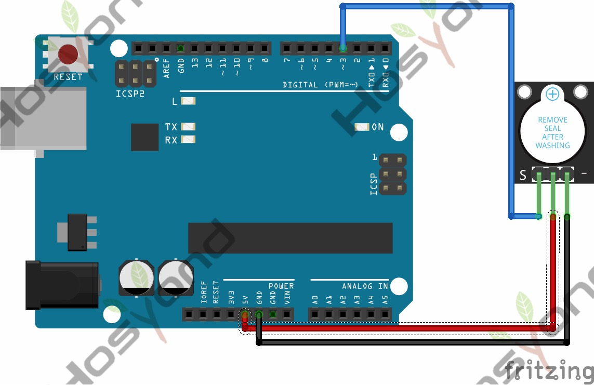

# 11 Active Buzzer

## Description

Here is the simplest sound making module. You can use high/low level to drive it.
Changing the frequency it buzzes can produce different sounds.

This module is widely used on our daily appliances like PC, refrigerator, phones, etc.

In addition, you can create many interesting interactive projects with this small
but useful module. Just try it!! You will find the electronic sound it creates so fascinating.

## Specification

- Working voltage: 3.3-5v
- Interface type: digital
- Size: 30*20mm
- Weight: 4g

## Connect



## Code

```rust
#[main]
fn main() -> ! {
    // generator version: 1.3.0
    // generator parameters: --chip esp32 -o esp32-wroom-32 -o unstable-hal

    let config = esp_hal::Config::default().with_cpu_clock(CpuClock::max());
    let peripherals = esp_hal::init(config);
    let delay = Delay::new();

    let mut buzzer = Output::new(
        peripherals.GPIO15,
        esp_hal::gpio::Level::Low,
        OutputConfig::default(),
    );

    loop {
        buzzer.set_high();
        delay.delay_millis(5000);
        buzzer.set_low();
        delay.delay_millis(5000);
    }
}
```

## References

- [Hosyond 45 in 1 Sensor Kit Documentation](https://45-in-1-sensor-kit.readthedocs.io/en/latest/11.active_buzzer.html)
