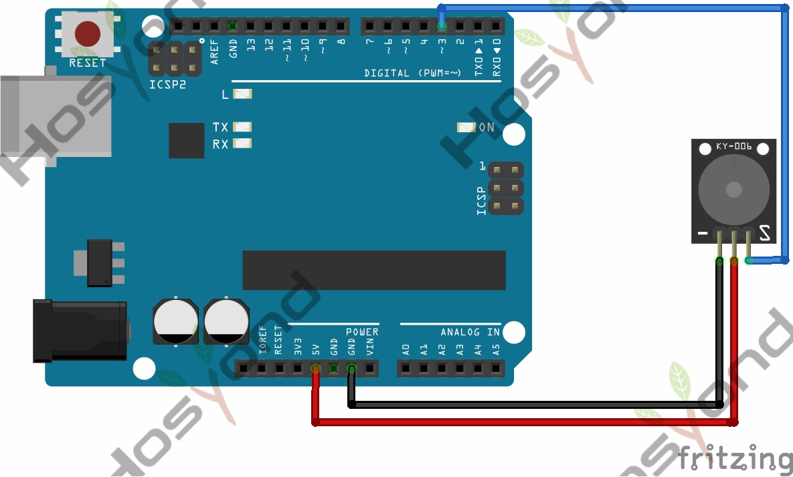

# 12 Passtive Buzzer

## Description

We can use Arduino to make many interactive works of which the most commonly used
is acoustic-optic display. The circuit in this experiment can produce sound.

Normally, the experiment can be done with a buzzer or a speaker, while buzzer is
simpler and easier to use.

The buzzer we introduced here is a passive buzzer. It cannot be actuated by itself,
but by external pulse frequencies. Different frequencies produce different sounds.
You can use Arduino to code the melody of a song, quite fun and simple.

## Specification

- Working voltage: 3.3-5v
- Interface type: digital
- Size: 30*20mm
- Weight: 4g

## Connect



## Code

```rust
#[main]
fn main() -> ! {
    let peripherals = esp_hal::init(esp_hal::Config::default());
    let delay = Delay::new();

    let mut ledc = Ledc::new(peripherals.LEDC);
    ledc.set_global_slow_clock(LSGlobalClkSource::APBClk);

    let mut lstimer0 = ledc.timer::<LowSpeed>(timer::Number::Timer0);
    lstimer0
        .configure(timer::config::Config {
            duty: timer::config::Duty::Duty8Bit,
            clock_source: timer::LSClockSource::APBClk,
            frequency: Rate::from_hz(660), // valore iniziale, cambia ad ogni nota
        })
        .unwrap();

    let mut buzzer = ledc.channel(channel::Number::Channel0, peripherals.GPIO18);
    buzzer
        .configure(channel::config::Config {
            timer: &lstimer0,
            duty_pct: 0, // parte in silenzio
            drive_mode: esp_hal::gpio::DriveMode::PushPull,
        })
        .unwrap();

    // (frequenza Hz, durata ms) - 0 Hz = pausa/silenzio
    const NOTES: &[(u32, u32)] = &[
        (660, 100),
        (0, 50),
        (660, 100),
        (0, 150),
        (660, 100),
        (0, 150),
        (510, 100),
        (0, 50),
        (660, 100),
        (0, 150),
        (770, 100),
        (0, 550),
        (380, 100),
        (0, 550),
        (510, 100),
        (0, 350),
        (380, 100),
        (0, 350),
        (320, 100),
        (0, 350),
        (430, 100),
        (0, 150),
        (480, 80),
        (0, 100),
        (450, 100),
        (0, 50),
        (430, 100),
        (0, 150),
        (380, 130),
        (0, 100),
        (660, 130),
        (0, 100),
        (760, 130),
        (0, 100),
        (860, 100),
        (0, 150),
        (700, 55),
        (0, 50),
        (760, 55),
        (0, 350),
        (660, 100),
        (0, 150),
        (510, 100),
        (0, 50),
        (580, 100),
        (0, 50),
        (480, 100),
        (0, 550),
    ];

    // `buzzer` borrows `lstimer0` for as long as it's alive, so the frequency can't be
    // changed through `lstimer0.configure()` (needs `&mut`) without violating the borrow
    // checker. `duty` resolution never changes, so poke the frequency divisor register
    // directly instead (`TimerHW` only needs `&self`).
    const DUTY_PRECISION: u64 = 1 << 8; // matches Duty8Bit above
    let apb_hz = lstimer0.freq().unwrap().as_hz() as u64;

    loop {
        for &(freq, dur) in NOTES {
            if freq == 0 {
                buzzer.set_duty(0).unwrap(); // silenzio per la pausa
            } else {
                let divisor = (apb_hz << 8) / freq as u64 / DUTY_PRECISION;
                lstimer0.configure_hw(divisor as u32);
                lstimer0.update_hw();
                buzzer.set_duty(50).unwrap(); // onda quadra al 50% = tono pieno
            }
            delay.delay_millis(dur);
        }
        delay.delay_millis(1500); // pausa prima di ripetere il loop
    }
}
```

## References

- [Hosyond 45 in 1 Sensor Kit Documentation](https://45-in-1-sensor-kit.readthedocs.io/en/latest/12.passtive_buzzer.html)
