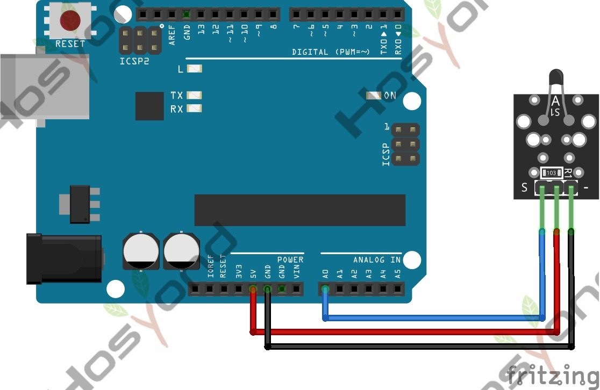

# 13 Analog Temperature

## Description

This module is based on the working principle of a thermistor (resistance varies
with temperature change in the environment).It can sense temperature changes in
the surrounding and send the data to the analog IO of Arduino board. All we need
to do is to convert the sensor’s output data into degrees Celsius temperature via
simple programming, finally displaying it on the monitor.

It’s both convenient and effective, thus it is widely applied to gardening, home
alarm system and other devices.

## Specification

- Interface type: analog
- Working voltage: 5V
- Temperature range: -55℃～315℃
- Size: 30*20mm
- Weight: 3g

## Connect



## Code

```rust
const B: f64 = 3950.0;

#[main]
fn main() -> ! {
    let peripherals = esp_hal::init(Config::default());

    let mut adc_config = AdcConfig::new();
    let mut adc_pin =
        adc_config.enable_pin(peripherals.GPIO34, esp_hal::analog::adc::Attenuation::_11dB);

    let mut adc = Adc::new(peripherals.ADC1, adc_config);

    let delay = Delay::new();

    loop {
        let raw_value: u16 = nb::block!(adc.read_oneshot(&mut adc_pin)).unwrap();

        let temp_c = calculate_ntc_temperature(raw_value);
        println!("Raw: {:<4} | Temp: {:.1}°C", raw_value, temp_c);

        delay.delay_millis(500);
    }
}

/// Convert Voltage to Celsius using the Beta Parameter Equation
/// Assumes:
/// - 10k Ohm Resistor in series (standard on KY-013)
/// - 3.3V Supply Voltage
/// - Beta Value = 3950 (standard for Hosyond kits)
fn calculate_ntc_temperature(raw_value: u16) -> f64 {
    1. / (libm::log(1. / (4096. / raw_value as f64 - 1.)) / B + 1.0 / 298.15) - 273.15
}
```

## References

- [Hosyond 45 in 1 Sensor Kit Documentation](https://45-in-1-sensor-kit.readthedocs.io/en/latest/13.analog_temperature.html)
