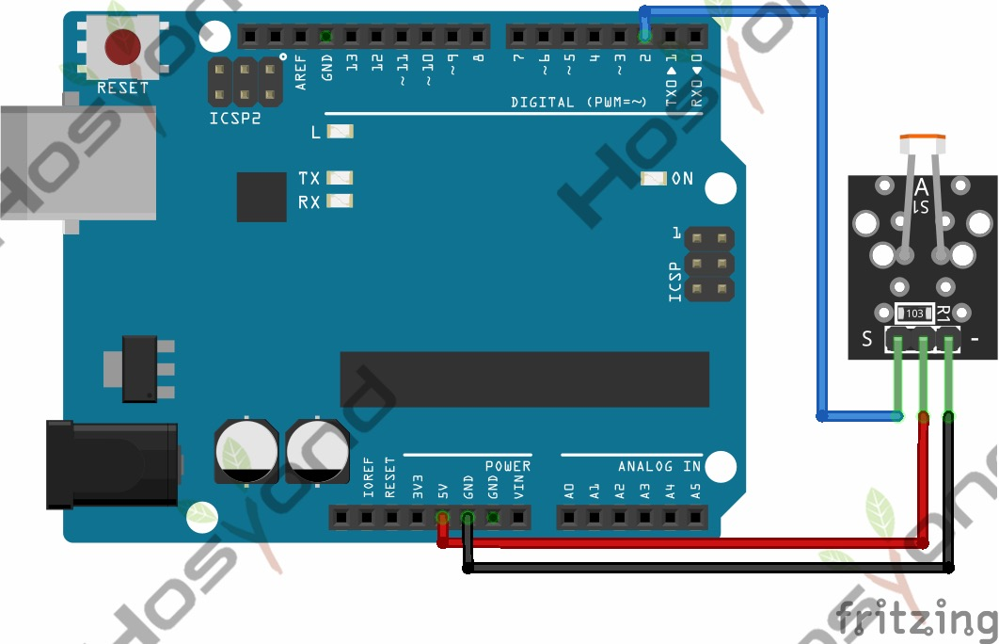

# 14 Photoresistor Module

## Description

Photocell is commonly seen in our daily life and is mainly used in intelligent
switch, also in common electronic design. To make it easier and more effective,
we supply the corresponding modules.

Photocell is a semiconductor. It has features of high sensitivity, quick response,
spectral characteristic and R-value consistence, maintaining high stability and
reliability in environment extremely such as high temperature and high humidity.
It’s widely used in automatic control switch fields like cameras, garden solar
lights, lawn lamps, money detectors, quartz clocks, music cups, gift boxes, mini
night lights, sound and light control switches, etc.

## Specification

- Interface type: analog
- Working voltage: 5V
- Size: 30*20mm
- Weight: 3g

## Connect



## Code

```rust
const MAX_VALUE: u16 = 4095;

#[main]
fn main() -> ! {
    let peripherals = esp_hal::init(Config::default());

    let mut adc_config = AdcConfig::new();
    let mut adc_pin =
        adc_config.enable_pin(peripherals.GPIO34, esp_hal::analog::adc::Attenuation::_11dB);

    let mut adc = Adc::new(peripherals.ADC1, adc_config);

    let delay = Delay::new();

    loop {
        let raw_value: u16 = nb::block!(adc.read_oneshot(&mut adc_pin)).unwrap();

        let res = (MAX_VALUE - raw_value) as f64 / MAX_VALUE as f64 * 100.0;

        println!("Raw: {:<4} | Lum: {:.0}%", raw_value, res);

        delay.delay_millis(500);
    }
}
```
## References

- [Hosyond 45 in 1 Sensor Kit Documentation](https://45-in-1-sensor-kit.readthedocs.io/en/latest/14.photoresistor_module.html)
