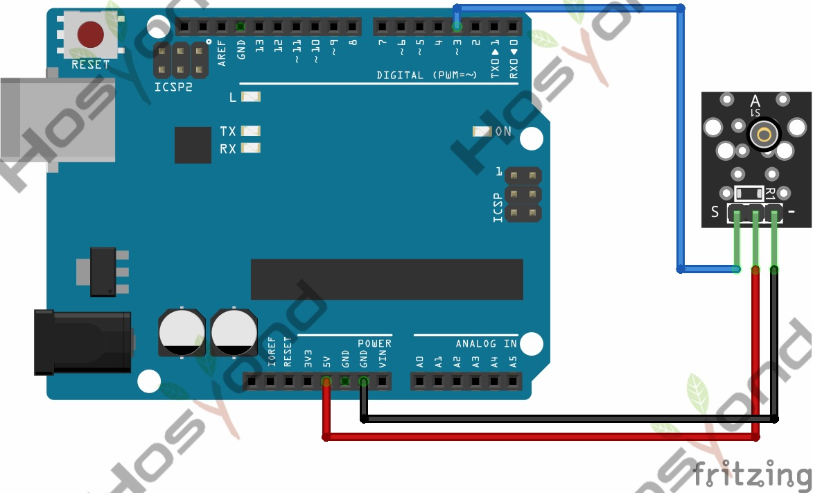

# 16 Shock Sensor

## Description

The KY-002 Vibration Switch Module detects shaking and knocking. When the module
is moved, a spring mechanism will close the circuit sending a short high signal.

It can be used with a variety of microcontrollers like Arduino, ESP32, Raspberry
Pi and others.

## Specification

- Operating Voltage     5V
- Board Dimensions      18.5mm x 15mm [0.728in x 0.591in]

## Connect



## Code

```rust
#[main]
fn main() -> ! {
    let peripherals = esp_hal::init(esp_hal::Config::default());
    let delay = Delay::new();

    let mut led = Output::new(peripherals.GPIO2, Level::Low, OutputConfig::default());
    let shock = Input::new(peripherals.GPIO15, InputConfig::default());

    loop {
        led.set_level(shock.level());

        delay.delay_millis(5);
    }
}
```

## References

- [Hosyond 45 in 1 Sensor Kit Documentation](https://45-in-1-sensor-kit.readthedocs.io/en/latest/16.shock_sensor.html)
