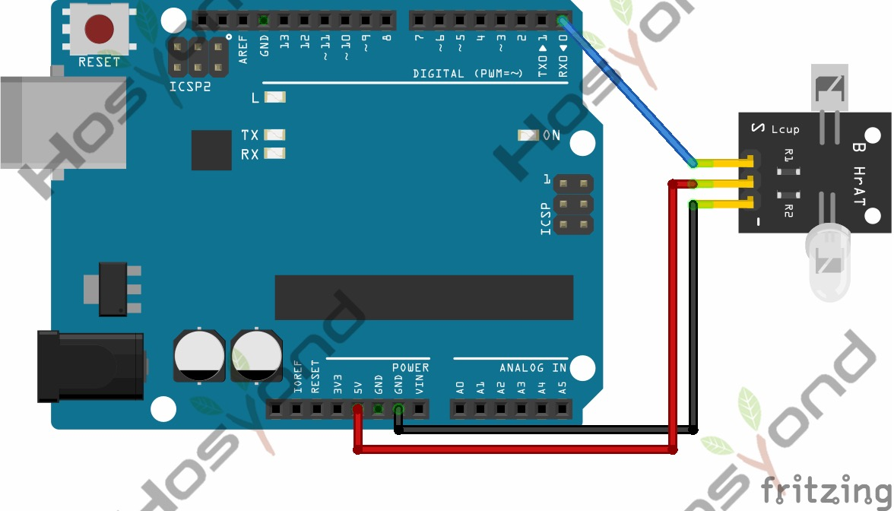

# 17 Pulse Rate Monitor

## Description

This module makes use of a ultra-clear infrared LED and a phototransistor to
detect the pulse in your finger. The red LED will flash in time with your pulse.

Shine the bright LED onto one side of your finger while the phototransistor on
the other side of your finger picks up the amount of transmitted light. The
resistance of the phototransistor will vary slightly as the blood pulses through
your finger.

## Specification

## Connect

## Code

## References

- [Hosyond 45 in 1 Sensor Kit Documentation](https://45-in-1-sensor-kit.readthedocs.io/en/latest/17.pulse_rate_monitor.html)
