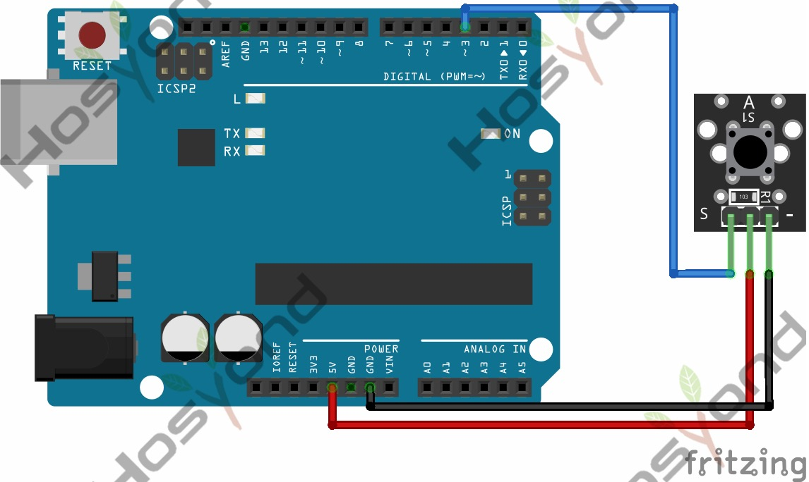

# 18 Button

## Description

This is a basic button module. You can simply plug it into an IO shield to have
your first try of Arduino.

## Specification

- Supply Voltage: 3.3V to 5V
- Interface: Digital
- Dimensions: 30*20mm
- Weight: 4g

## Connect



## Code

```rust
#[main]
fn main() -> ! {
    let peripherals = esp_hal::init(esp_hal::Config::default());
    let delay = Delay::new();

    let mut led = Output::new(peripherals.GPIO18, Level::Low, OutputConfig::default());
    let button = Input::new(peripherals.GPIO15, InputConfig::default());

    loop {
        led.set_level(button.level());
        delay.delay_millis(5);
    }
}
```

## References

- [Hosyond 45 in 1 Sensor Kit Documentation](https://45-in-1-sensor-kit.readthedocs.io/en/latest/18.button.html)
