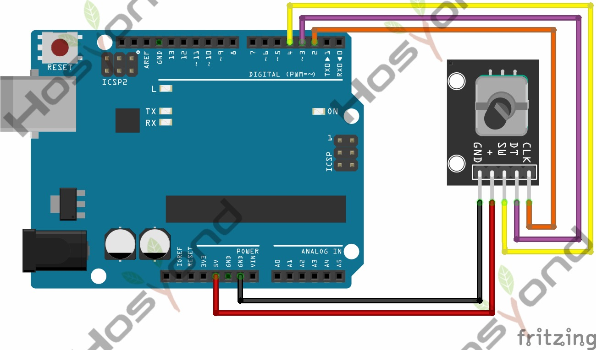

# 19 Rotary Encoder

## Description

The rotary encoder can count the pulse outputting times during the process of
rotation in positive and reverse direction.

This rotating counting is unlimited, not like potential counting. It can be
restored to initial state to count from 0.

## Specification

- Power Supply: 5V
- Interface: Digital
- Size: 30*20mm
- Weight: 7g

## Connect



## Code

```rust
#[main]
fn main() -> ! {
    let peripherals = esp_hal::init(esp_hal::Config::default());
    let delay = Delay::new();

    let clk = Input::new(peripherals.GPIO15, InputConfig::default());
    let dt = Input::new(peripherals.GPIO18, InputConfig::default());
    let _sw = Input::new(peripherals.GPIO19, InputConfig::default());

    let mut position: i32 = 0;
    let mut last_clk = clk.level();

    loop {
        let current_clk = clk.level();
        if current_clk != last_clk && current_clk == Level::Low {
            if dt.level() != current_clk {
                position += if position < MAX { 1 } else { 0 };
            } else {
                position -= if position > MIN { 1 } else { 0 };
            }
            println!("Position: {position}");
        }
        last_clk = current_clk;

        delay.delay_millis(1);
    }
}
```

## References

- [Hosyond 45 in 1 Sensor Kit Documentation](https://45-in-1-sensor-kit.readthedocs.io/en/latest/19.rotary_encoder.html)
