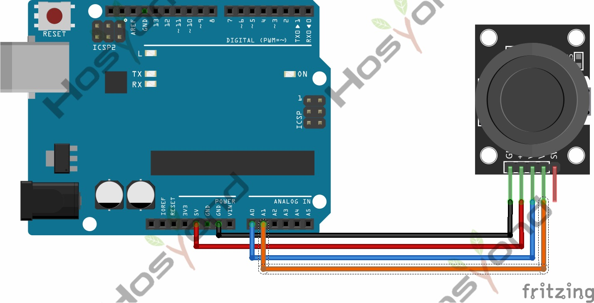

# 20 Joystick

## Description

Lots of robot projects need joystick.   This module provides an affordable solution.
By simply connecting to two analog inputs, the robot is at your commands with X,
Y control.

## Specification

- Supply Voltage: 3.3V to 5V
- Interface: Analog x2, Digital x1
- Size: 40*28mm
- Weight: 12g

## Connect



## Code

```rust
#[main]
fn main() -> ! {
    let peripherals = esp_hal::init(esp_hal::Config::default());
    let delay = Delay::new();

    let mut adc_config = AdcConfig::new();
    let mut vrx_pin = adc_config.enable_pin(peripherals.GPIO34, Attenuation::_11dB);
    let mut vry_pin = adc_config.enable_pin(peripherals.GPIO35, Attenuation::_11dB);
    let mut adc = Adc::new(peripherals.ADC1, adc_config);

    let sw = Input::new(
        peripherals.GPIO32,
        InputConfig::default().with_pull(Pull::Up),
    );

    loop {
        let x: u16 = nb::block!(adc.read_oneshot(&mut vrx_pin)).unwrap();
        let y: u16 = nb::block!(adc.read_oneshot(&mut vry_pin)).unwrap();
        let pressed = sw.is_low();

        println!("X: {x:<4} | Y: {y:<4} | Pressed: {pressed}");

        delay.delay_millis(100);
    }
}
```

## References

- [Hosyond 45 in 1 Sensor Kit Documentation](https://45-in-1-sensor-kit.readthedocs.io/en/latest/20.Joystick.html)
