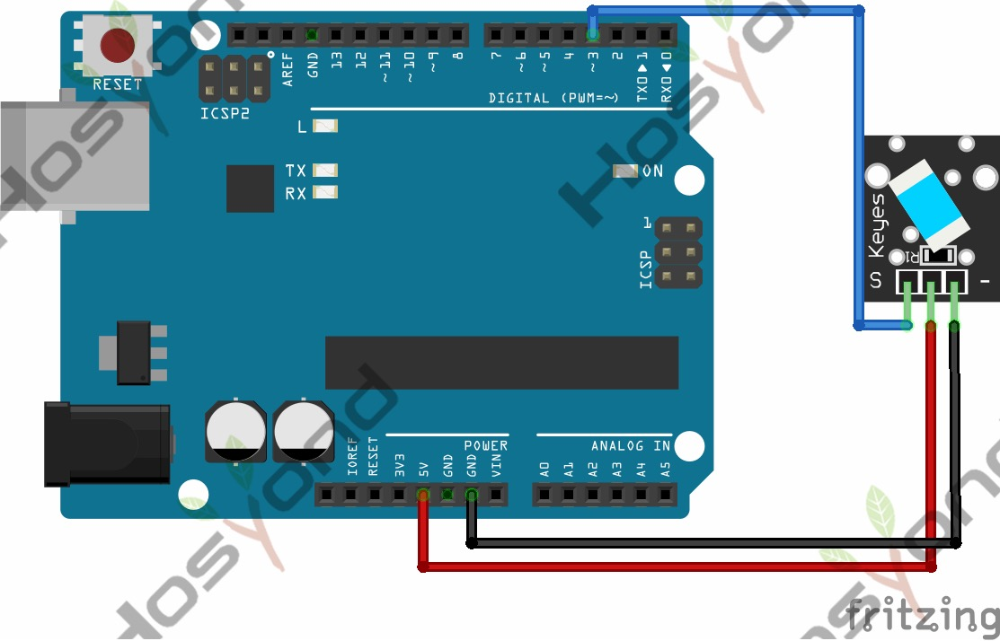

# 21 Tilt Switch

## Description

Tilt Sensor is a digital tilt switch. It can be used as a simple tilt switch.
Simply plug it to our IO/Sensor shield, easy for wire connection. With dedicated
sensor shield and Arduino, you can make lots of interesting and interactive works.

## Specification

- Supply Voltage: 3.3V to 5V
- Interface: Digital
- Size: 30*20mm
- Weight: 3g

## Connect

## Code

## References

- [Hosyond 45 in 1 Sensor Kit Documentation](https://45-in-1-sensor-kit.readthedocs.io/en/latest/21.tilt_switch.html)
