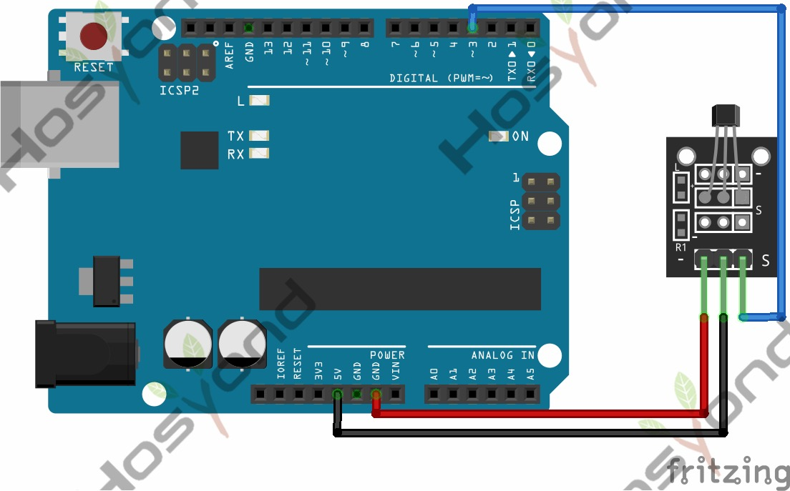

# 22 Ky 035 Hall Sensor

## Description

This is a magnetic induction sensor. It can sense the magnetic materials within
a detection range up to 3cm.
The detection range and the strength of magnetic field are proportional. The output
is digital on/off.
This sensor uses the SFE Reed Switch - Magnetic Field Sensor.

## Specification

- Sensing magnetic materials
- Detection range: up to 3cm
- Output: digital on/off
- Size: 30*20mm
- Weight: 3g

## Connect

## Code

## References

- [Hosyond 45 in 1 Sensor Kit Documentation](https://45-in-1-sensor-kit.readthedocs.io/en/latest/22.ky-035_hall_sensor.html)
