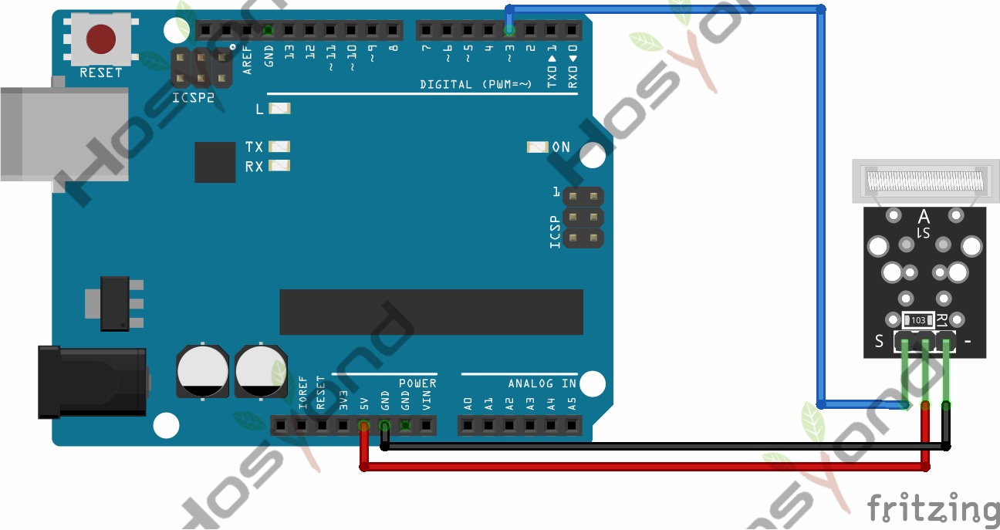

# 23 Tap Module

## Description

This module is a knock sensor. When you knock it, it can send a momentary signal.
You can combine it with Arduino to make some interesting experiments, e.g. electronic drum

## Specification

- Working voltage: 5V
- Size: 30*20mm
- Weight: 3g

## Connect



## Code

```rust
#[main]
fn main() -> ! {
    let peripherals = esp_hal::init(esp_hal::Config::default());
    let delay = Delay::new();

    let mut led = Output::new(peripherals.GPIO2, Level::Low, OutputConfig::default());
    let switch = Input::new(peripherals.GPIO32, InputConfig::default());
    let mut last_state = Level::Low;

    loop {
        if switch.is_low() {
            last_state = if last_state == Level::Low {
                Level::High
            } else {
                Level::Low
            };
            led.set_level(last_state);
            delay.delay_millis(5);
        }
    }
}
```

## References

- [Hosyond 45 in 1 Sensor Kit Documentation](https://45-in-1-sensor-kit.readthedocs.io/en/latest/23.tap_module.html)
