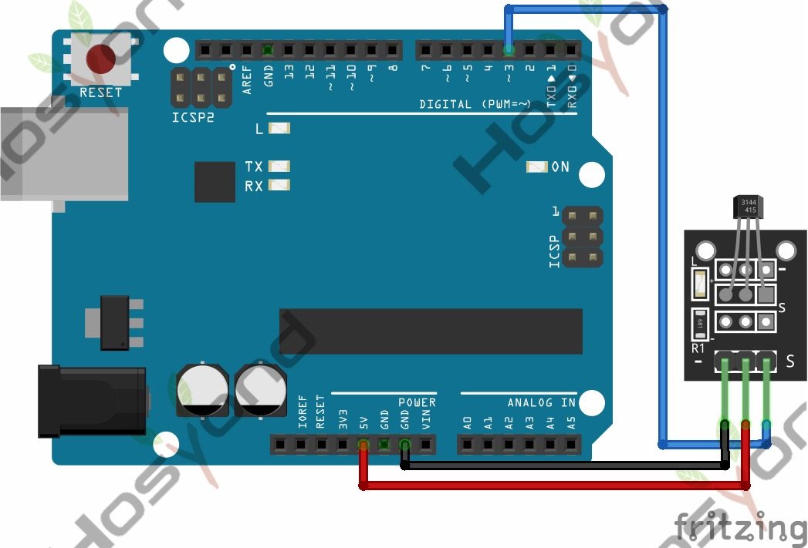

# 24 Ky 003 Hall Sensor

## Description

The KY-003 Hall Magnetic Sensor module is a switch that reacts to the presence
of a magnetic field, turning itself on or off. Compatible with popular microcont
rolers like Arduino, Raspberry Pi and ESP32.This module offers a digital output.

## Specification

- Operating Voltage     4.5V to 24V
- Operating Temperature Range   -40°C to 85°C
- Board Dimensions      18.5mm x 15mm

## Connect



## Code

```rust
#[main]
fn main() -> ! {
    let peripherals = esp_hal::init(esp_hal::Config::default());
    let delay = Delay::new();

    let mut led = Output::new(peripherals.GPIO2, Level::Low, OutputConfig::default());
    let switch = Input::new(peripherals.GPIO15, InputConfig::default());

    loop {
        if switch.is_high() {
            led.set_low();
        } else {
            led.set_high();
        }
        delay.delay_millis(5);
    }
}
```

## References

- [Hosyond 45 in 1 Sensor Kit Documentation](https://45-in-1-sensor-kit.readthedocs.io/en/latest/24.ky-003_hall_sensor.html)
