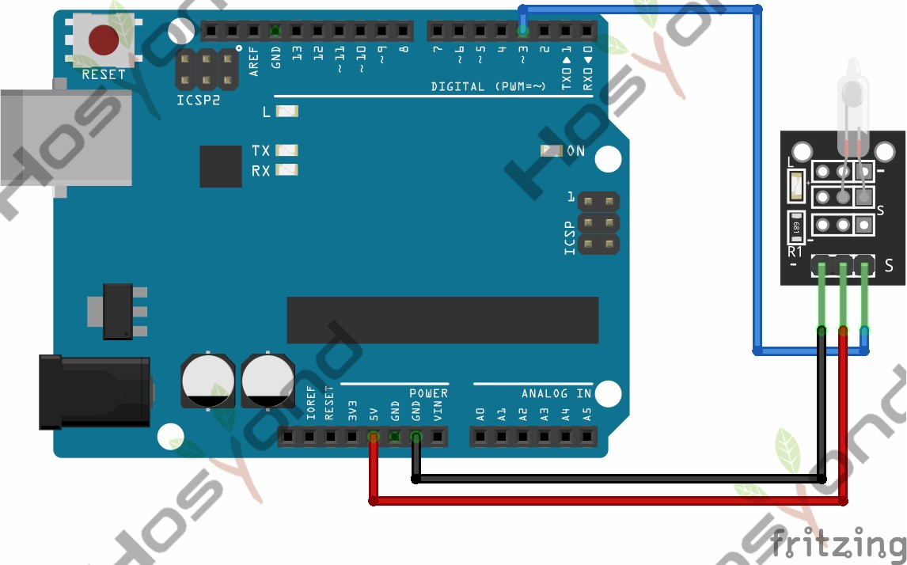

# 25 Mercury Tilt Switch

## Description

The KY-017 Mercury Tilt Switch module is a switch that responds to movement. It uses a small mercury ball that completes the circuit when the module is tilted.

## Specification

- Operating Voltage     3.3V ~ 5.5V

## Connect



## Code

```rust
#[main]
fn main() -> ! {
    let peripherals = esp_hal::init(esp_hal::Config::default());
    let delay = Delay::new();

    let mut led = Output::new(peripherals.GPIO2, Level::Low, OutputConfig::default());
    let switch = Input::new(peripherals.GPIO15, InputConfig::default());

    loop {
        led.set_level(switch.level());
        delay.delay_millis(5);
    }
}
```

## References

- [Hosyond 45 in 1 Sensor Kit Documentation](https://45-in-1-sensor-kit.readthedocs.io/en/latest/25.mercury_tilt_switch.html)
