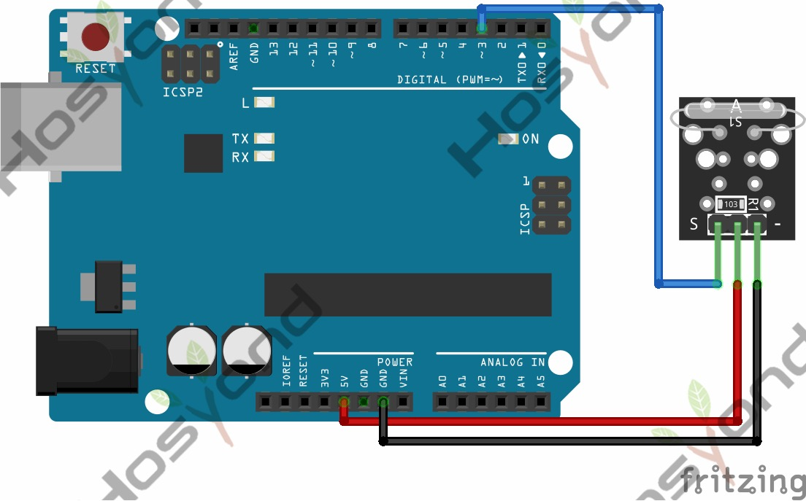

# 26 Reed Switch

## Description

The KY-021 Magnetic Reed Switch module is a switch that is normally open and gets
closed when exposed to a magnetic field, sending a digital signal. Commonly used
in mechanical systems as proximity sensors.

## Specification

- Operating Voltage     3.3V ~ 5V
- Output Type   Digital
- Board Size    18.5mm x 15mm

## Connect

## Code

## References

- [Hosyond 45 in 1 Sensor Kit Documentation](https://45-in-1-sensor-kit.readthedocs.io/en/latest/26.reed_switch.html)
