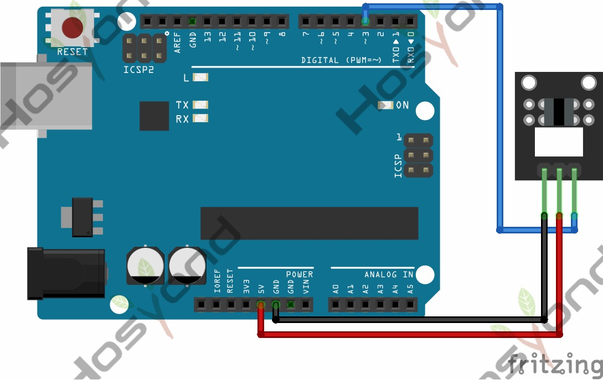

# 27 Photo Interrupter Module

## Description

The KY-010 Photo Interrupter module is a switch that will trigger a signal when light between the sensor’s gap is blocked.
This module is suitable for various electronics platforms like Arduino, Raspberry Pi, ESP32 and others.

## Specification

- Operating Voltage     3.3V ~ 5V
- Board Dimensions       18.5mm x 15mm

## Connect



## Code

```rust
#[main]
fn main() -> ! {
    let peripherals = esp_hal::init(esp_hal::Config::default());
    let delay = Delay::new();

    let mut led = Output::new(peripherals.GPIO2, Level::Low, OutputConfig::default());
    let switch = Input::new(peripherals.GPIO15, InputConfig::default());

    loop {
        if switch.is_high() {
            led.set_high();
        } else {
            led.set_low();
        }
        delay.delay_millis(5);
    }
}
```

## References

- [Hosyond 45 in 1 Sensor Kit Documentation](https://45-in-1-sensor-kit.readthedocs.io/en/latest/27.photo_interrupter_module.html)
