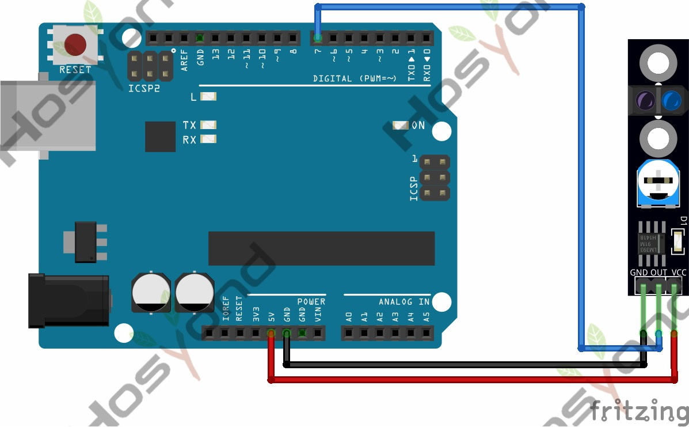

# 28 Line Tracking Sensor Module

## Description

The KY-033 Line Tracking module is an infrared sensor that detects whether the
surface in front of it is reflective or opaque. Sensitivity to ambient light can
be adjusted using the knob to achieve a fairly accurate reading.

This sensor is typically used on wheeled robots and can operate at 3.3V to 5V
which makes it compatible with a variety of microcontrollers like Arduino, ESP32
, Raspberry Pi, ESP8266, Teensy, and others.

## Specification

- Working voltage       3.3V — 5.5V DC
- Output signal TTL level (high level if line detected, low if no line detected)
- Board Size    1cm x 4.2cm

## Connect



## Code

```rust
#[main]
fn main() -> ! {
    let peripherals = esp_hal::init(esp_hal::Config::default());
    let delay = Delay::new();

    let mut led = Output::new(peripherals.GPIO2, Level::Low, OutputConfig::default());
    let switch = Input::new(peripherals.GPIO15, InputConfig::default());

    loop {
        if switch.is_high() {
            led.set_high();
            println!("Line detected!")
        } else {
            led.set_low();
            println!("Line NOT detected!")
        }
        delay.delay_millis(5);
    }
}
```

## References

- [Hosyond 45 in 1 Sensor Kit Documentation](https://45-in-1-sensor-kit.readthedocs.io/en/latest/28.line_tracking_sensor_module.html)
