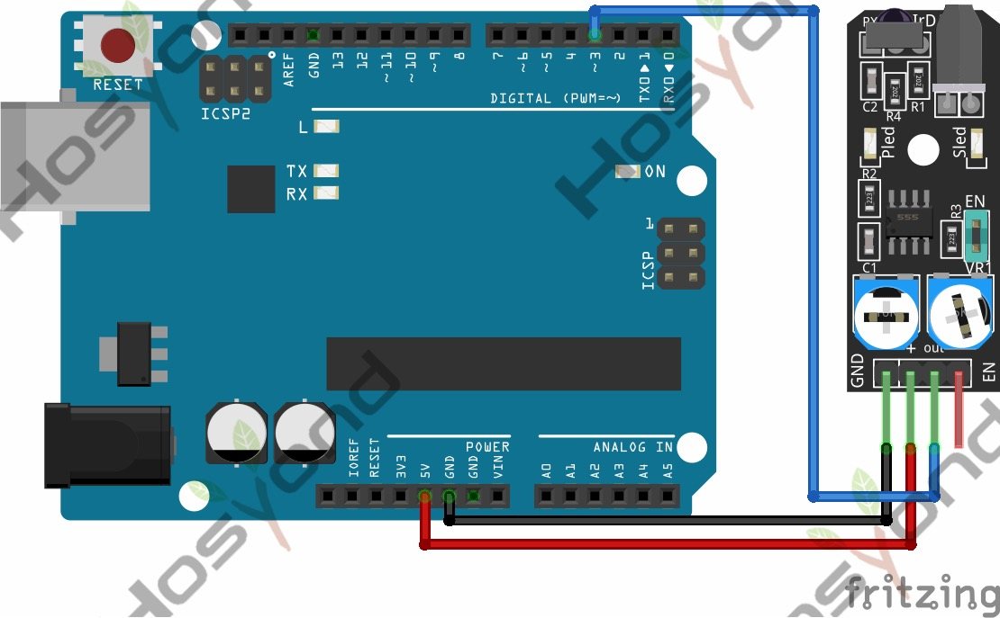

# 29 Infrared Obstacle Avoidance Sensor Module

## Description

The module has a pair of infrared LEDs, an emitter, and a receiver. The emitting
LED sends infrared light pulses at a certain frequency. When the light hits an
obstacle is reflected back to the receiver LED.

The KY-032 has 4 pins: GND, +, S (out), and EN. The jumper makes the module
permanently enabled so it’s always detecting for obstacles. To control the state
of the sensor remove the jumper and use the EN pin, a HIGH signal will enable the
sensor and a LOW signal will disable it.

You can adjust the detection distance by turning the left knob, turn it to the
middle for maximum distance. The right knob controls the frequency of the emitting
IR pulse, turn it clockwise all the way to set the emitter to the right frequency
required to work with the receiver.

## Specification

- Working voltage       3.3V – 5V DC
- Working current       ≥ 20mA
- Working temperature   -10°C – 50°C
- Detection distance    2cm – 40cm
- IO interface  4-wire interface (/EN/+/S/-)
- Output signal TTL level (low level if obstacle detected, high if no obstacle)
- Adjustment method     multi-turn resistance adjustment
- Effective angle       35°
- Board Size    1.6cm x 4cm [0.62in x 1.57in]
- Weight        9g

## Connect



## Code

```rust
#[main]
fn main() -> ! {
    let peripherals = esp_hal::init(esp_hal::Config::default());
    let delay = Delay::new();

    let mut led = Output::new(peripherals.GPIO2, Level::Low, OutputConfig::default());
    let switch = Input::new(peripherals.GPIO15, InputConfig::default());

    loop {
        if switch.is_low() {
            led.set_high();
        } else {
            led.set_low();
        }
        delay.delay_millis(5);
    }
}
```

## References

- [Hosyond 45 in 1 Sensor Kit Documentation](https://45-in-1-sensor-kit.readthedocs.io/en/latest/29.infrared_obstacle_avoidance_sensor_module.html)
