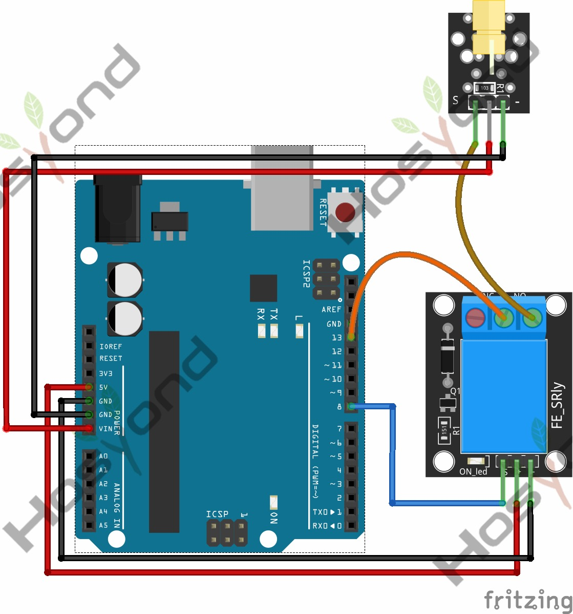

# 30 Relay

## Description

The KY-019 consist of a 1MΩ resistor, a LED, a 1N4007 rectifier diode and a 5VDC
relay capable of handling up to 250VAC and 10A.

On the DC side of the board there are 3 male header pins for signal, power and
ground. On the AC side there are 3 contacts, NC (Normally Closed),  Common and
NO (Normally Open).

## Specification

- TTL Control Signal    5VDC to 12VDC (some boards may work with 3.3)
- Maximum AC    10A 250VAC
- Maximum DC    10A 30VDC
- Contact Type  NC and NO
- Board Dimensions      27mm x 34mm

## Connect



## Code

```rust
#[main]
fn main() -> ! {
    let peripherals = esp_hal::init(esp_hal::Config::default());
    let delay = Delay::new();

    let mut relay = Output::new(peripherals.GPIO15, Level::Low, OutputConfig::default());

    loop {
        relay.set_high();
        delay.delay_millis(1000);
        relay.set_low();
        delay.delay_millis(1000);
    }
}
```

## References

- [Hosyond 45 in 1 Sensor Kit Documentation](https://45-in-1-sensor-kit.readthedocs.io/en/latest/30.relay.html)
