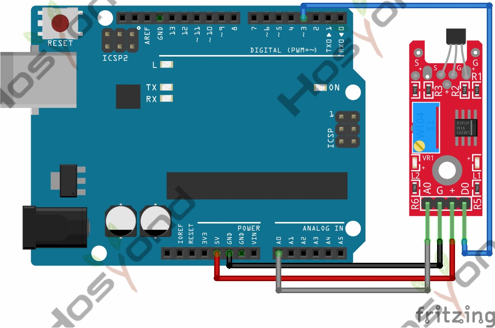

# 32 Linear Magnetic Hall Module

## Description

The KY-024 Linear magnetic Hall sensor reacts in the presence of a magnetic field.
It has a potentiometer to adjust the sensitivity of the sensor and it provides both
analog and digital outputs.

The digital output acts as a switch that will turn on/off when a magnet is near,
similar to the KY-003. On the other hand, the analog output can measure the
polarity and relative strength of the magnetic field.

Compatible with popular electronics platforms like Arduino, Raspberry Pi,
Esp32, Teensy and others.

## Specification

- Operating Voltage     2.7V to 6.5V
- Sensitivity   1.0 mV/G min., 1.4 mV/G typ., 1.75 mV/G max.
- Board Dimensions      1.5cm x 3.6cm

## Connect

## Code

## References

- [Hosyond 45 in 1 Sensor Kit Documentation](https://45-in-1-sensor-kit.readthedocs.io/en/latest/32.linear_magnetic_hall_module.html)
