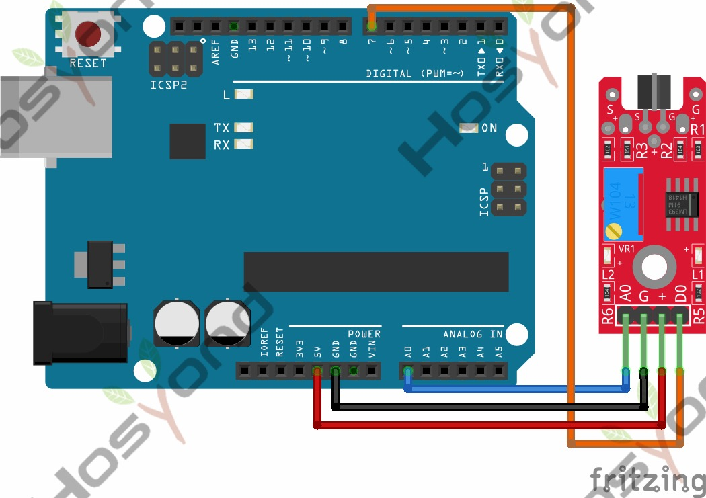

# 33 Metal Touch Sensor Module

## Description

The KY-036 Metal Touch Sensor Module is an analog/digital sensor that uses a
transistor to detect changes in electrical conductivity. When the transistor is
touched with a finger, the conductivity changes and the module emits a digital
and analog signal.

The digital output can be used a switch that changes state when touched. The
analog output can measure the intensity of the touch. The detection threshold
can be regulated using the on-board potentiometer.

Compatible with popular microcontroller boards like Arduino, ESP32, ESP8266 and
Raspberry.

## Specification

- Operating voltage     3.3V ~ 5.5V
- Board Dimensions      15mm x 36mm

## Connect



## Code

```rust
#[main]
fn main() -> ! {
    let peripherals = esp_hal::init(esp_hal::Config::default());
    let delay = Delay::new();

    let dig_in = Input::new(peripherals.GPIO18, InputConfig::default());

    let mut adc_config = AdcConfig::default();
    let mut adc_pin =
        adc_config.enable_pin(peripherals.GPIO4, esp_hal::analog::adc::Attenuation::_11dB);
    let mut adc = Adc::new(peripherals.ADC1, adc_config);

    let mut led = Output::new(peripherals.GPIO2, Level::Low, OutputConfig::default());

    loop {
        led.set_level(dig_in.level());

        let anal_val = nb::block!(adc.read_oneshot(&mut adc_pin)).unwrap();
        println!("{anal_val}");

        delay.delay_millis(100);
    }
}
```

## References

- [Hosyond 45 in 1 Sensor Kit Documentation](https://45-in-1-sensor-kit.readthedocs.io/en/latest/33.metal_touch_sensor_module.html)
