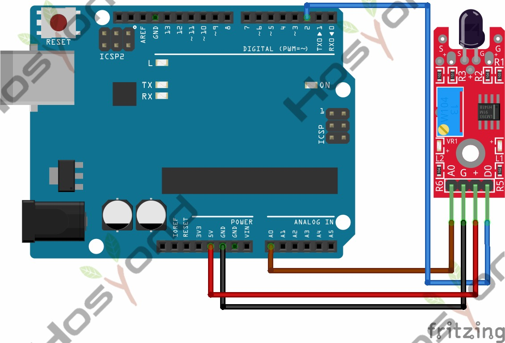

# 34 Flame Sensor Module

## Description

The KY-026 Flame Sensor module detects infrared light emitted by fire. This
module has both digital and analog outputs and a potentiometer to adjust the
sensitivity. Commonly used in fire detection systems.

Compatible with Arduino, Raspberry Pi, ESP32 and other microcontrollers.

## Specification

- Operating Voltage     3.3V ~ 5.5V
- Infrared Wavelength Detection 760nm ~ 1100nm
- Sensor Detection Angle        60°
- Board Dimensions      1.5cm x 3.6cm

## Connect

## Code

## References

- [Hosyond 45 in 1 Sensor Kit Documentation](https://45-in-1-sensor-kit.readthedocs.io/en/latest/34.flame_sensor_module.html)
