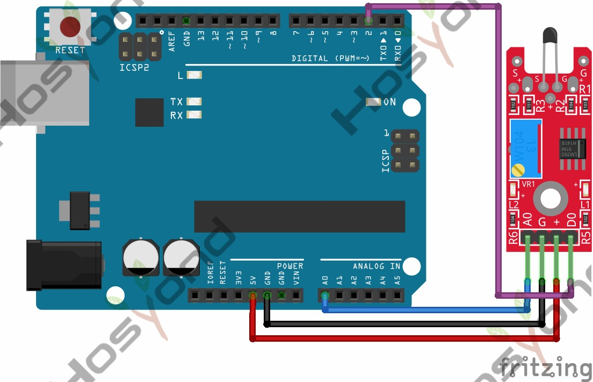

# 35 Digital Temperature Sensor Module

## Description

The KY-028 Digital Temperature Sensor measures temperature changes based on thermistor
resistance. This module has both digital and analog outputs, there’s a potentiometer to
djust the detection threshold on the digital interface.

Compatible with Arduino, Raspberry Pi, ESP32, and other microcontrollers.

## Specification

- Operating Voltage     3.3V ~ 5.5V
- Temperature Measurement Range -55°C to 125°C
- Measurement Accuracy  ±0.5°C
- Board Dimensions      15mm x 36mm

## Connect

## Code

## References

- [Hosyond 45 in 1 Sensor Kit Documentation](https://45-in-1-sensor-kit.readthedocs.io/en/latest/35.digital_temperature_sensor_module.html)
