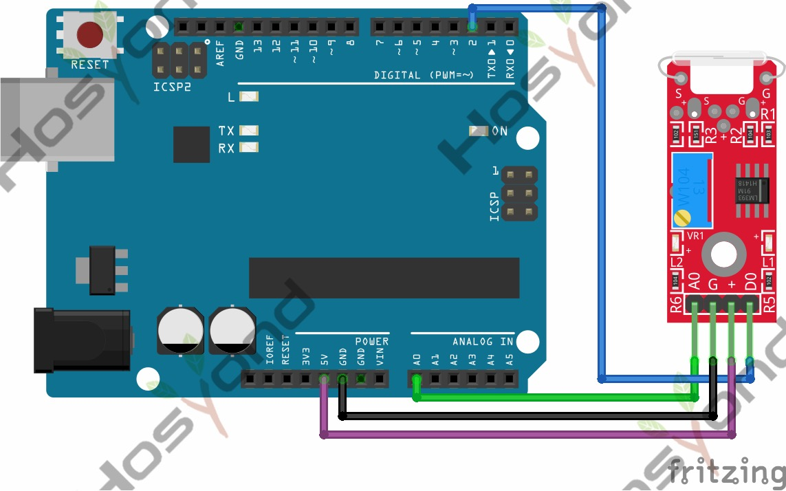

# 36 Reed Switch Module

## Description

The KY-025 Reed Switch Module is a small electrical switch operated by an applied
magnetic field, commonly used as proximity sensor.
The module has both digital and analog outputs. A trimmer is used to calibrate
the sensitivity of the sensor.
Compatible with Arduino, Raspberry Pi, ESP32 and other microcontrollers.
For digital output only use the KY-021 mini reed switch.

## Specification

## Connect

## Code

## References

- [Hosyond 45 in 1 Sensor Kit Documentation](https://45-in-1-sensor-kit.readthedocs.io/en/latest/36.reed_switch_module.html)
