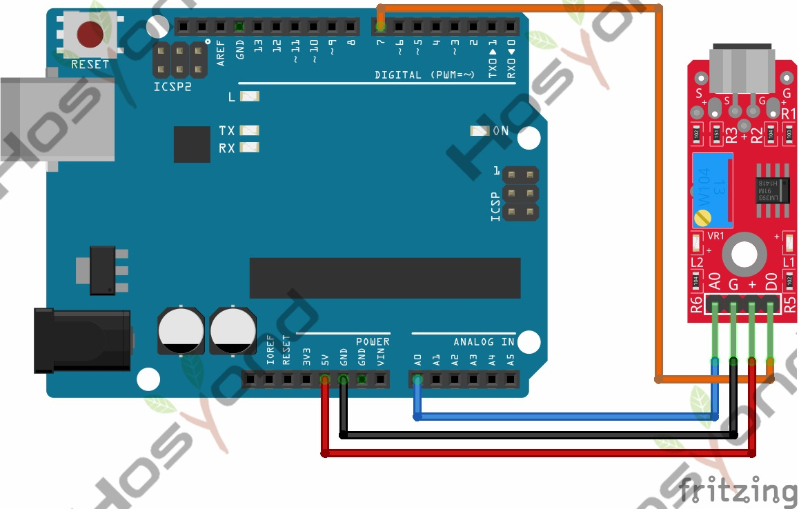

# 37 High Sensitivity Sound Detection Module

## Description

The KY-037 high sensitivity sound detection module is an analog/digital sensor
that uses a condenser microphone to observe changes in environment noise. Generally
used to detect sound above certain levels. It has a potentiometer to set the noise
detection threshold.

The digital output provides a HIGH signal when sound above the threshold is
detected. The analog output shows values representing the noise levels detected
by the condenser microphone, the values are relative to the provided voltage and
potentiometer position, making it difficult to reconstruct the audio from the
obtained values.

This module is compatible with popular microcontroller platforms like Arduino,
ESP32, ESP8266, and Raspberry Pi.

## Specification

- Operating voltage     3.3V ~ 5.5V
- Microphone sensitivity        -42 ±3 db
- Current consumption   ~0.5mA
- Board Dimensions      15mm x 36mm

## Connect



## Code

```rust
#[main]
fn main() -> ! {
    let peripherals = esp_hal::init(esp_hal::Config::default());
    let delay = Delay::new();

    let dig_in = Input::new(
        peripherals.GPIO14,
        InputConfig::default().with_pull(esp_hal::gpio::Pull::None),
    );

    let mut adc_config = AdcConfig::default();
    let mut adc_pin =
        adc_config.enable_pin(peripherals.GPIO32, esp_hal::analog::adc::Attenuation::_11dB);
    let mut adc = Adc::new(peripherals.ADC1, adc_config);

    let mut led = Output::new(peripherals.GPIO2, Level::Low, OutputConfig::default());

    loop {
        if dig_in.is_high() {
            led.set_high();
        } else {
            led.set_low();
        }

        let anal_val = nb::block!(adc.read_oneshot(&mut adc_pin)).unwrap();
        println!("{anal_val}");

        delay.delay_millis(500);
    }
}
```

## References

- [Hosyond 45 in 1 Sensor Kit Documentation](https://45-in-1-sensor-kit.readthedocs.io/en/latest/37.high_sensitivity_sound_detection_module.html)
