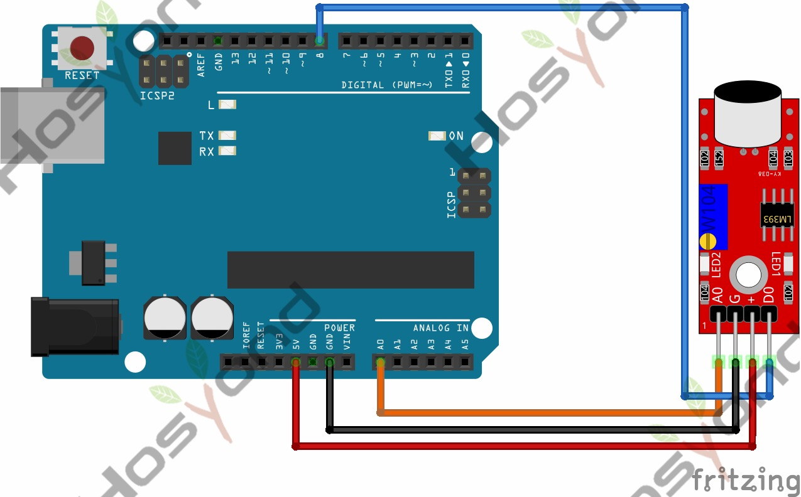

# 38 Microphone Sound Sensor Module

## Description

In this tutorial, we will learn about the KY-038 module, how it works and we will
build a simple project using the KY-038 module and an Arduino.The KY-038 Module
will be our main component for this tutorial.

This module has a microphone, and an LM393 differential comparator mounted on a
breakout board with a potentiometer and several resistors.

## Specification

- Operation Voltage     3.3V ~ 5.5V
- Board Dimensions      1.5cm x 3.5cm
- Weight: 3.1g

## Connect



## Code

```rust
#[main]
fn main() -> ! {
    let peripherals = esp_hal::init(esp_hal::Config::default());
    let delay = Delay::new();

    let dig_in = Input::new(
        peripherals.GPIO14,
        InputConfig::default().with_pull(esp_hal::gpio::Pull::None),
    );

    let mut adc_config = AdcConfig::default();
    let mut adc_pin =
        adc_config.enable_pin(peripherals.GPIO32, esp_hal::analog::adc::Attenuation::_11dB);
    let mut adc = Adc::new(peripherals.ADC1, adc_config);

    let mut led = Output::new(peripherals.GPIO2, Level::Low, OutputConfig::default());

    loop {
        if dig_in.is_high() {
            led.set_high();
        } else {
            led.set_low();
        }

        let anal_val = nb::block!(adc.read_oneshot(&mut adc_pin)).unwrap();
        println!("{anal_val}");

        delay.delay_millis(500);
    }
}
```

## References

- [Hosyond 45 in 1 Sensor Kit Documentation](https://45-in-1-sensor-kit.readthedocs.io/en/latest/38.microphone_sound_sensor_module.html)
