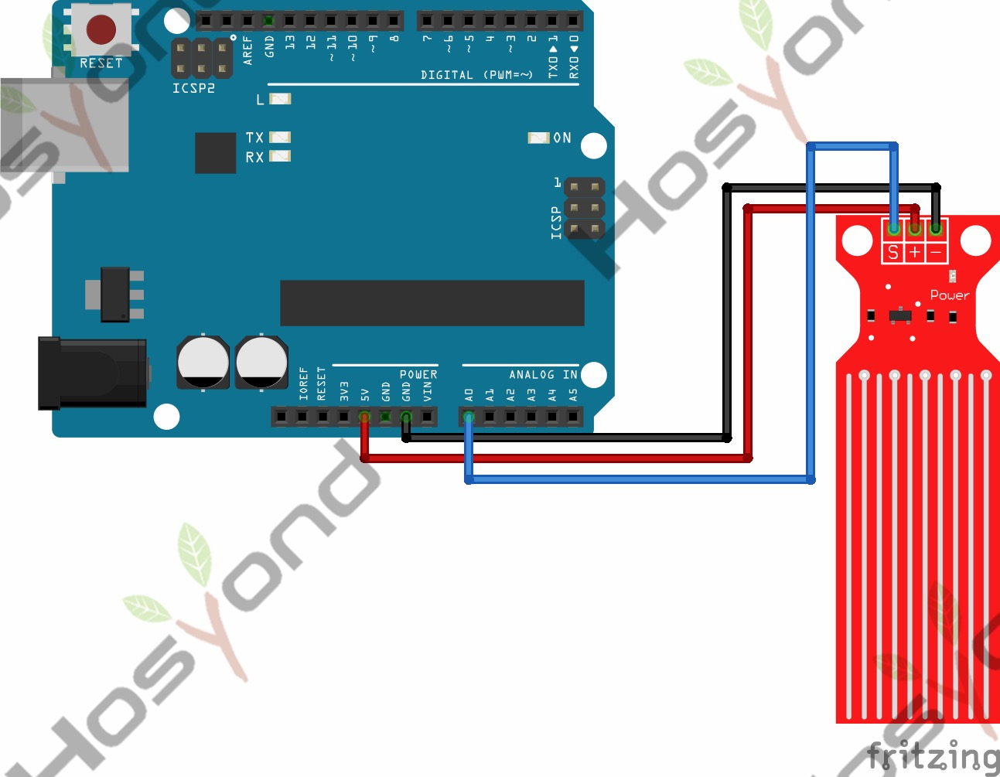

# 39 Water Level Sensor

## Description

The sensor has ten exposed copper traces, five of which are power traces and the
remaining five are sense traces. These traces are interlaced so that there is
one sense trace between every two power traces.

Normally, power and sense traces are not connected, but when immersed in water,
they are bridged.

There is a Power LED on the board, which will light up when the board is powered.

The power and sense traces form a variable resistor (much like a potentiometer)
whose resistance varies based on how much they are exposed to water.

## Specification

- Working voltage: DC3-5V
- Sensor type: simulation
- Work current: less than 20mA
- Detective area: 40mmx16mm
- Work temperature: 10 ℃ -30 ℃

## Connect

## Code

## References

- [Hosyond 45 in 1 Sensor Kit Documentation](https://45-in-1-sensor-kit.readthedocs.io/en/latest/39.water_level_sensor.html)
