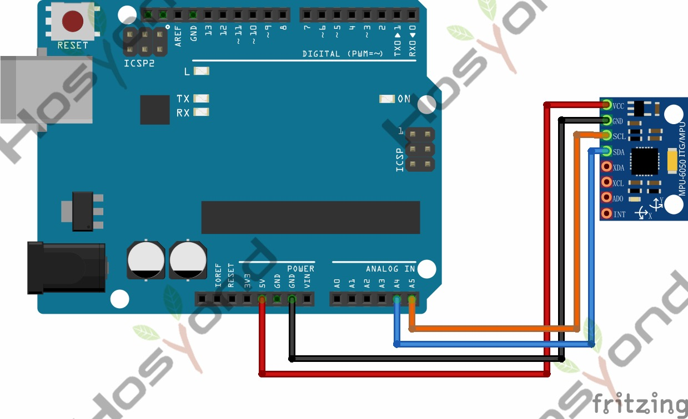

# 40 Gy521 Module

## Description

The GY-521 module features a 3-axis gyroscope, a 3-axis accelerometer, a digital
motion processor (DMP), and a temperature sensor.The digital motion processor can
be used to process complex algorithms directly on the board.

## Specification

- Chip Used: MPU-6050
- Power Supply: 3-5V (internal low-dropout voltage regulator)
- Communication Method: Standard I2C communication protocol
- Built-in 16-bit AD converter, 16-bit data output
- Gyroscope Range: ±250, ±500, ±1000, ±2000 °/s
- Accelerometer Range: ±2, ±4, ±8, ±16g

## Connect

## Code

## References

- [Hosyond 45 in 1 Sensor Kit Documentation](https://45-in-1-sensor-kit.readthedocs.io/en/latest/40.gy521_module.html)
