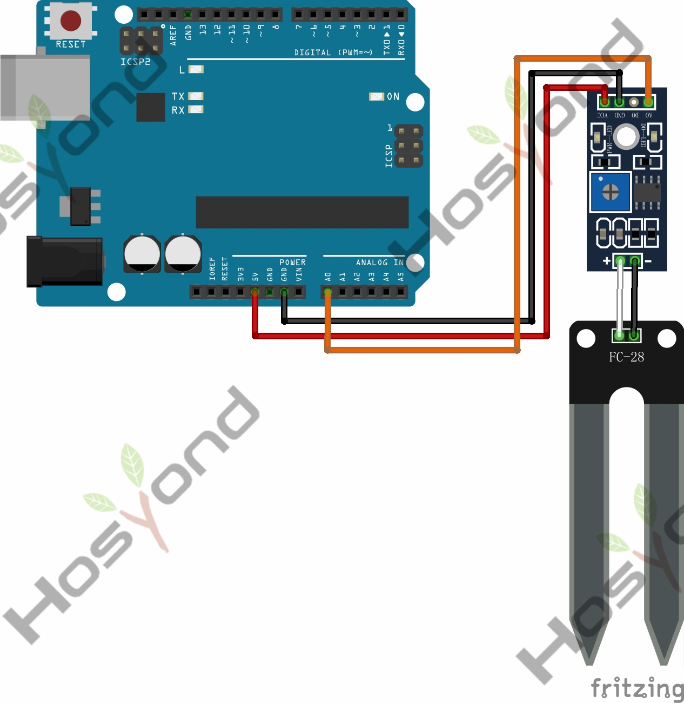

# 42 Soil Moisture Sensor

## Description

The soil moisture sensor or the hygrometer is usually used to detect the humidity
of the soil. So, it is perfect to build an automatic watering system or to monitor
the soil moisture of your plants.

The sensor is set up by two pieces: the electronic board (at the right), and the
probe with two pads, that detects the water content (at the left).

The sensor has a built-in potentiometer for sensitivity adjustment of the digital
output (D0), a power LED and a digital output LED, as you can see in the following
figure.

## Specification

## Connect

## Code

## References

- [Hosyond 45 in 1 Sensor Kit Documentation](https://45-in-1-sensor-kit.readthedocs.io/en/latest/42.soil_moisture_sensor.html)
