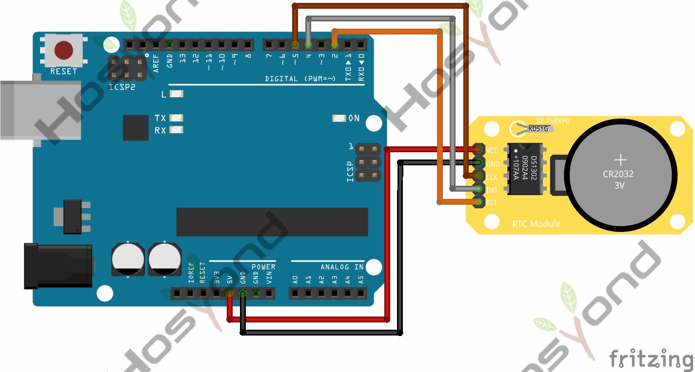

# 43 Ds1302 Rtc Module

## Description

The DS1320 RTC is a compact real time battery backed clock module capable of
accurately keeping the current time and date. It includes a 24 hour clock consisting
of hours, minutes & seconds and a calendar which stores the current year in 2 digits,
month and date. The calendar is also capable of correcting for months with different
amounts of days and leap years. Additionally there is a day of the week counter to
keep track of the current date.

## Specification

## Connect

## Code

## References

- [Hosyond 45 in 1 Sensor Kit Documentation](https://45-in-1-sensor-kit.readthedocs.io/en/latest/43.ds1302_rtc_module.html)
