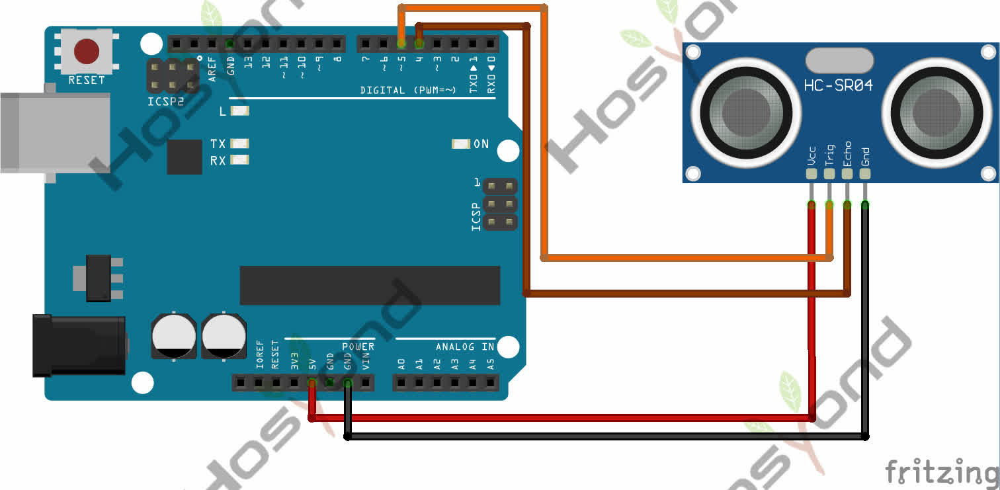

# Ultrasonic Module

## Description

Oled screen.

## Specification

- Definition: 128x64

## Connect



## Code

```rust
#[main]
fn main() -> ! {
    let peripherals = esp_hal::init(esp_hal::Config::default());
    let delay = Delay::new();

    let i2c = I2c::new(
        peripherals.I2C0,
        I2cConfig::default().with_frequency(Rate::from_khz(400)),
    )
    .unwrap()
    .with_sda(peripherals.GPIO21)
    .with_scl(peripherals.GPIO22);

    let interface = I2CDisplayInterface::new(i2c);
    let mut display = Ssd1306::new(interface, DisplaySize128x64, DisplayRotation::Rotate0)
        .into_buffered_graphics_mode();
    display.init().unwrap();

    let text_style = MonoTextStyleBuilder::new()
        .font(&FONT_6X10)
        .text_color(BinaryColor::On)
        .build();

    Text::with_baseline("Hello, World!", Point::new(0, 0), text_style, Baseline::Top)
        .draw(&mut display)
        .unwrap();

    let image = Image::new(&raw_image, Point::new(64, 0));
    image.draw(&mut display).unwrap();

    display.flush().unwrap();

    loop {
        delay.delay_millis(1000);
    }
}
```

## References

- [Hosyond](https://45-in-1-sensor-kit.readthedocs.io/en/latest/45.ultrasonic_module.html)
